# **Building an AI Virtual Concierge lab**
--
**Author :** Stephen Salim | AWS Partner Solutions Architect | Email : sssalim@amazon.com


Welcome to "Building an AI Virtual Concierge lab" !

In this lab you will be building a virtual concierge powered using [Amazon Sumerian](https://aws.amazon.com/sumerian/). We will be Levaraging AWS AI service, [Amazon Rekognition](https://aws.amazon.com/rekognition/), to allow your Sumerian to idenitfy who you are. We will then create a workflow will be defined using a service called [AWS StepFunction](https://aws.amazon.com/step-functions/) to get our sumerian host to greet you, check if you have an appointment, and notify a of your arrival. 

The purpose of this lab is, to showcase one of the many possibilities you can integrate AWS services to create a customised concierge experience for your business need. Here is a high level overview of what we are going to build today.

* We will create a sumerian scene that will capture your face from WebCam footage. 
* The Scene will then run the detected face against our Amazon Rekognition face collection to idetify if the face is recognised. 
* Sumerian will start a workflow that will in turn create a session, trigger our sumerian host to greet the person detected, check for appointment, and finally notify host upon guest arrival.
* The notified host will then, receive an email with a pre configured url to trigger thr workflow to continue which will then then trigger our Sumerian host to notify guest that the host has confirmed their arrival.

This is just one of the many possible way you could design your workflow to suit your business need. In practice, you could customise the workflow to do whatever action you see fit. From sending email, making a phone call, or maybe... trigger your coffee machine to make you a coffee. The possibilies are endless !


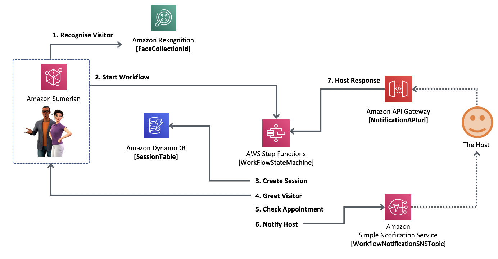

### **Note:**

We will be deploying services that may or may not be available on your typical AWS region of choice. Therefore, putting your best experience in mind, we recommend running this lab in **us-west-2 ( Oregon Region )**


## **Step 1 - Deploying the Sumerian Resources.** 

In this step we will be building the Amazon Sumerian environment and configuring the environment so that it can connect to the rest of the workflow. If we have 2 hours to run this lab, we would go through building the sumerian scene from scratch. But since we have limited time, I have packaged the sumerian scene in a zip file ready for you to import and configure to get running.


Sumerian is based in javascript, and in our scene today there will be a number of scripts that are basically responsible to do the following.

* **WebCam Script** : Capture visitor face from WebCam, Find a match in Amazon Recognition Collection & Visitor database then send Notification to the Session Manager SNS topic to trigger the main workflow.
* **Registration Script** : Capture visitor face from WebCam, Register face in Amazon Recognition Collection & Visitor database then send Notification to the Session Manager SNS topic to trigger the main workflow.
* **Message Pooler Script** : Poll SQS message for any new message from the workflow and then trigger Read & Display Message script

**Key Services we will deploy in this step:**

* [Amazon Cognito](https://aws.amazon.com/cognito/) to provide access for our sumerian scene to AWS APIs including to start the workflow.
* [Amazion Sumerian](https://aws.amazon.com/sumerian/) used to provide an representation of virtual host for the user. 

<details><summary>[ EXPAND ] to see the detailed architectual diagram.</summary>


	
</details>


Please follow these steps to import your sumerian scene :
	
1. From [AWS Console](https://us-west-2.console.aws.amazon.com/) in the Search bar type in Sumerian, select and click Sumerian service.
	
	
	
2. You should then be taken to the Sumerian Console (as per below). Click **Create New Scene**, 
	
	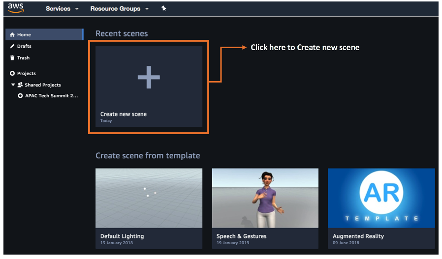
	
3. Enter `<Your full name>-devlabs-vcdemo` as the scene name, then click **Create **to start a blank scene.
	
	

4. Download Sumerian scene bundle from [HERE](https://s3-us-west-2.amazonaws.com/sssalim-devlabs-virtualconcierge/devlabs.zip)
	
5. Click **Import Asset**.
	
	
	
6. Click **Browse** and select the Zip file you downloaded, or just drag the Zip file to the Drop your file here... area.
	
	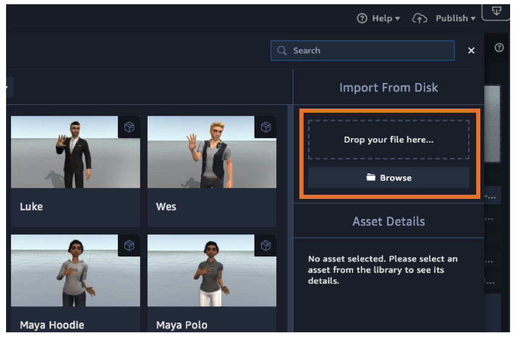
	
7. This will then load the entire asset in the bundle to the scene. Depending on the internet speed the loading of the scene might take up to 5 minutes. Once the scene is fully loaded you should see all the entities populated on the left hand side if the menu. 
	
	

8. (Optional) Play around with Camera Controls.
I'll be handy to know how to control your Editor Camera, which is the camera used in the Sumerian editing mode. The editor camera is an Orbit camera, but with unique controls that enable you to click and select entities within the canvas. 

	<details><summary>[ CLICK HERE ] for Editor Camera mouse and key list.</summary>
	<p>
	To control the Editor Camera with a mouse (Windows and Mac):
	
	* Hold right-click to orbit
	* Hold left-click + Shift hold to pan
	* Hold middle-click to pan
	* Scroll wheel to zoom in/out
	
	To control the Editor Camera with a trackpad (Mac):
	
	* Hold click + hold Control to orbit
	* Hold click + hold Shift to pan.
	* Two-finger vertical swipe to zoom in/out
	
	To control the Editor Camera with a trackpad (Windows):
	
	* Hold right-click + to orbit
	* Hold left-click + hold Alt to orbit
	* (Hold left-Click + hold Shift to pan.
	* Vertical or horizontal swipe two fingers to zoom in/out
	
	Keyboard controls and hotkeys:
	
	* F:Pressing the F key will automatically frame the selected entity in the center of your canvas.
	* Z:Pressing the Z key will give return your editor camera to it’s last position. Note: This hotkey only works when using other camera hotkeys.
	* X: Pressing the X key will place the editor camera near the Y and Z Translation values of 0, creating a side view parallel with the X axis. Pressing the X key a second time provide the inverse view.
	* C: Pressing the C key will place the editor camera near the Y and X Translation values of 0, creating a side view parallel with the Z axis. Pressing the C key a second time provide the inverse view.
	* X: Pressing the V key will place the editor camera near the X and Z Translation values of 0, creating a top view parallel with the Y axis.. Pressing the X key a second time provide the inverse view.

	</p>
	</details>


9. Click on the **VCCamera** entity press **F** in your keyboard and scroll up your mouse until you see your host in the scene.
	
10. Select the **VCCamera** entity in the left menu, then tick the **Main Camera** option on the right hand side menu. This will basically set the scene to use the entity called `Main Camera` as the default camera to load the scene
	
	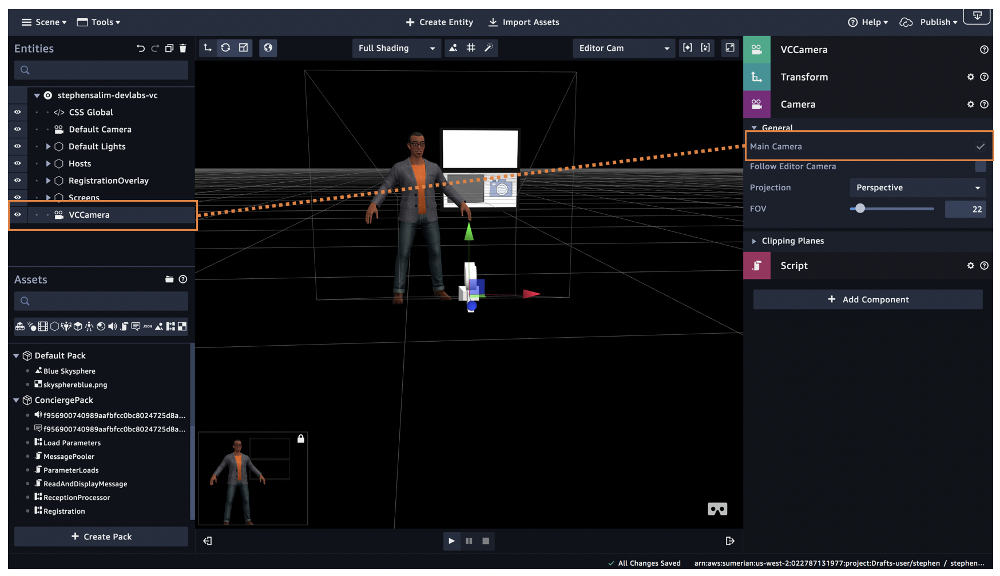
		
11. Try clicking the play button on the scene, If you correctly set the camera up, your scene should automatically load with the host zoomed in like below. Once you confirm this, stop by pressing the stop button in the scene.
	
	
	
	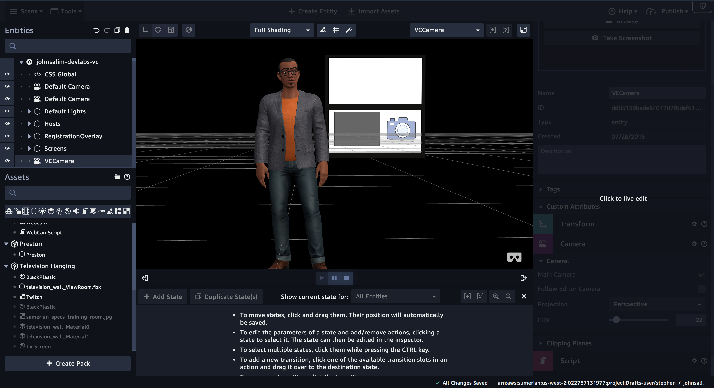
	
12. At this stage your sumerian host will looks like it's alive. but then your scene will not work properly. You won't be able to take your picture to send to the workflow to recognise you. 

13. This is because the webcam script is not yet activate, and we have not configured our scene jacasvript parameters to reference our backend resources to do the activity. Follow along on the next step to deploy all the backend resources to support our scene today.
	
</p>
</details>
	


## **Step 2 - Deploying Face Rekognition & Workflow** 

The next thing we are going to build is the Face recognition services and our workflow backend. The resource we are going to deploy in this step, will be used to Indentifying user Face, and Record the Visitor detail. Following after, our process will then trigger a workflow that will receive an input containing face information from a face detection mechanism we built from the previous step. It will then provide instructions to our summerian host to read the appropriate action according to the flow. 

Here are the list of services we will be using:

* [Amazon Rekognition](https://aws.amazon.com/rekognition/) This will be used to identify if visitor's face is known or unknown.
* [Amazon S3](https://aws.amazon.com/s3/) will be used store visitor profile picture. 
* [Amazon DynamoDB](https://aws.amazon.com/dynamodb/) will be used to store a session visitor detail information.
* [AWS Step Functions](https://aws.amazon.com/step-functions/) state machine to orchestrate the main activities.
* [AWS Lambda](https://aws.amazon.com/lambda/) functions to support the workflow, including a the session manager to execute the workflow.
* [Amazon Simple Notification Service](https://aws.amazon.com/sns/) to interface inbound channel to thr workflow as well as outbound notification.
* [Amazon Simple Queue Service](https://aws.amazon.com/sqs/) to interface messaging from workflow to the Sumerian environment.
* [Amazon API Gateway](https://aws.amazon.com/api-gateway/) to allow external service to response to the notification sent by the workflow.

<details><summary>[ EXPAND ] to see the detailed diagram</summary>

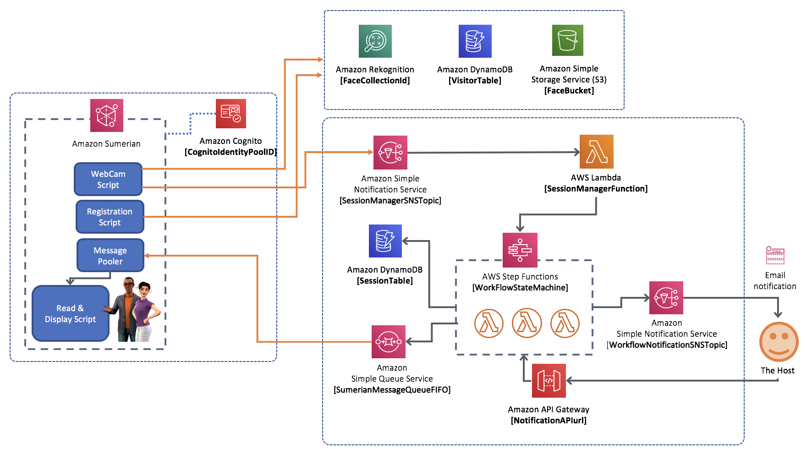

</details>


### Deploy Cognito Identity Pool ###

To enable all the above Sumerian scene will need access AWS service api with the approproate credential. and to facilitate that we will be using [Amazon Cognito](https://aws.amazon.com/cognito/) identitiy pool.

* Click below to deploy your Identity Pool stack:
	
	[](https://console.aws.amazon.com/cloudformation/home?region=us-west-2#/stacks/new?stackName=vc-identity&templateURL=https://s3-us-west-2.amazonaws.com/sssalim-devlabs-virtualconcierge/vc-identity.yaml)

* Click **Next**.

	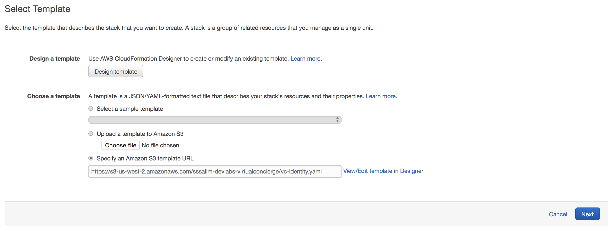

* Click **Next**.

	

* Check the option acknowleging that CloudFormation will create IAM resource.
* Click **Next**.

	

* The Value of resources deployed in this step will be needed to configure the sumerian scene on step 3. To find out the information about resources deployed you can look at the CloudFormation Stack.
		
* Click Services on [AWS Console](https://us-west-2.console.aws.amazon.com/) in the Search bar type in CloudFormation, select and click CloudFormation service.
		
	
		 
* Select the `vc-identity` stack and click on the output tab take note of the 
		
	
			
	Take note the value of : 
	
	* `CognitoIdentityPoolID`

	This will be needed to configure Sumerian in **Step 3** of this lab.


### Deploy WorkFlow ###

* Click below to deploy your WorkFlow stack:

	[](https://console.aws.amazon.com/cloudformation/home?region=us-west-2#/stacks/new?stackName=vc-workflow&templateURL=https://s3-us-west-2.amazonaws.com/sssalim-devlabs-virtualconcierge/vc-workflow.yaml)

* Click **Next**.

	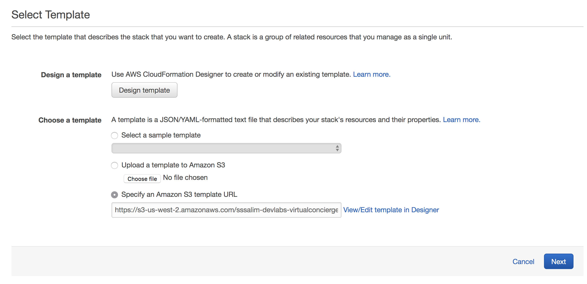

* Enter a valid email address on `HostEmailAddress` field ( This will be the email address of the Host ).
* Enter your full name in lowercase on `YourFullName` field ( This will be used as prefix naming convention ).
* Click **Next**

	

* Click **Next**.

* Check the option acknowleging that CloudFormation will create IAM resource and IAM resource with Custom Name. 

* Click **Create Change Set**, Wait until change set is created.

	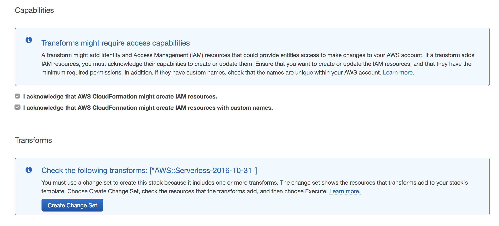

* Click **Create Stack**

	

* Wait until the stack deployed is complete, then follow the steps below.

* Check the email you've specified above, look for subscription email from SNS.
* Click `confirm` to confirm the email subscription to the topic.

* The Value of resources deployed in this step will be needed to configure the sumerian scene on step 3. To find out the information about resources deployed you can look at the CloudFormation Stack.
	
* Click Services on [AWS Console](https://us-west-2.console.aws.amazon.com/) in the Search bar type in CloudFormation, select and click CloudFormation service.
	
	

* Select the `vc-workflow` stack and click on the output tab.

	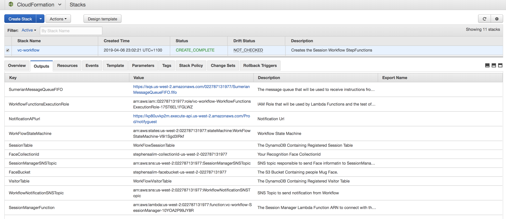

	Take note the value of : 
	
	* `FaceCollectionId `
	* `FaceBucket `
	* `VisitorTable `	
	* `SessionManagerSNSTopic `
	* `SumerianMessageQueueFIFO `
	
	This will be needed to configure Sumerian in **Step 3** of this lab.


## **Step 3 - Connecting Sumerian and Workflow** 
	
	
### Configuring Parameters
1. From [AWS Console](https://us-west-2.console.aws.amazon.com/) in the Search bar type in Sumerian, select and click Sumerian service.
	
	

2. Open the Sumerian Scene you created in step 1.

3. Click on **Tools** and **Text Editor**

	

4. Select the **Parameter Loader** script. This script is responsible in loading all reference to the workflow resources in the scene.
5. Change the value of each of the variables with the designated values you took note from CloudFormation in previous steps.
	
	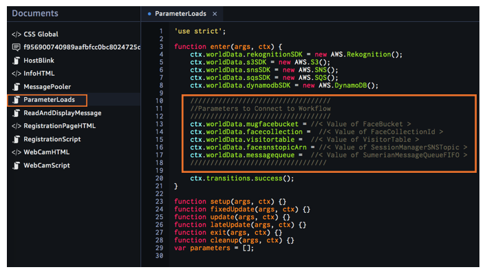
	
	Here's a code snippet you can copy and paste.
	Replace the variable value with the resources valued deployed in step 2
	Make sure there are no space before or after the ' ' sign
	
	```
	ctx.worldData.mugfacebucket = '< Replace with FaceBucket value>'
	ctx.worldData.facecollection = '< Replace with FaceCollectionId value>'
	ctx.worldData.visitortable = '<Replace with VisitorTable value>'
	ctx.worldData.facesnstopicArn = '<Replace with SessionManagerSNSTopic value>'
	ctx.worldData.messagequeue = '<Replace with SumerianMessageQueueFIFO value>'
	```
	
	Once you configured them correctly it should look like this.
	
	
6. Press **ctrl+s** (Windows) or **command+s** (Mac) in the Text Editor to save all changes. (Make sure the text editor indicator is green, this means that changes are saved)

	


### Configuring Identitiy pool
1. Now that all reference to the workflow is configured, the next thing to do is to provide Amazon Sumerian access to those resources. And we do this by referncing the Cognito Identity Pool we created earlier at the begining of this step.

2. Click on the root of your entity scene, then on the right hand menu expand the AWS Configuration section. Look for Cognito Identity Pool ID, Paste in the value of `CognitoIdentityPoolID` you took note in step 2.

	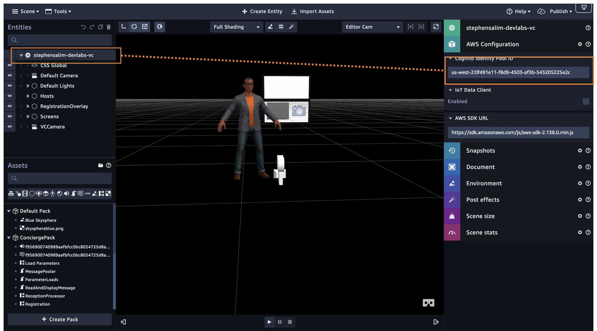

3. Press **ctrl+s** (Windows) or **command+s** (Mac) to save all changes.

	

### Attaching Behaviour Script

1. The last thing we need to do in this scene to get everything working is to activate our script in the scene. 

2. This is so that we can get our WebCam and Workflow trigger working.

3. To do this we need to attach a Sumerian Behaviour consisting our Sumerian Java Scripts into an Entity. To find out more about Sumerian Behaviours and entity please refer to this [link](https://docs.sumerian.amazonaws.com/tutorials/create/beginner/state-machine-basics/)

4. In this scenario we will use the Sumerian Host entity to attach the behavour.

5. On the left hand side menu, expand the `Host` entity and click on `Preston` entity. 
6. Then locate the State Machine section of the host as shown on screen shot below  

	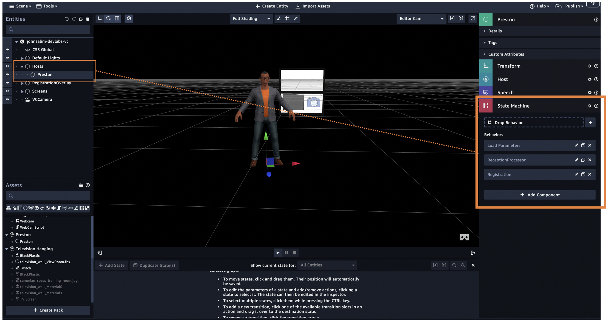

7. On the bottom left section of the menu locate a behaviour asset called `WebCam` 

	

8. Drag the `WebCam` entity to the `Drop Behaviour` section of the State Machine you expand on the step above 

	

9. Once you've successfully attached the behaviour you should see `WebCam` listed as one of the attached behaviour on the Sumerian Host Preston.

	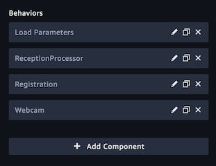


10. Try clicking the play button on the scene, If you correctly set the camera up, your scene should automatically load with the host zoomed in like below. Once you confirm this, stop by pressing the stop button in the scene.
	
	
	
	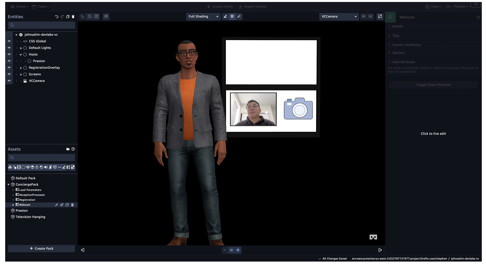

11. You can continue running next step using this Editor Mode or you can publish the scene publicly and run the test there.

## **Step 4 - Play.**

Alright ! You are now set to test the Virtual Concierge. **~(^0^)~** 

We have finished building and configuring components of our scene, now it is time to test the experience. 

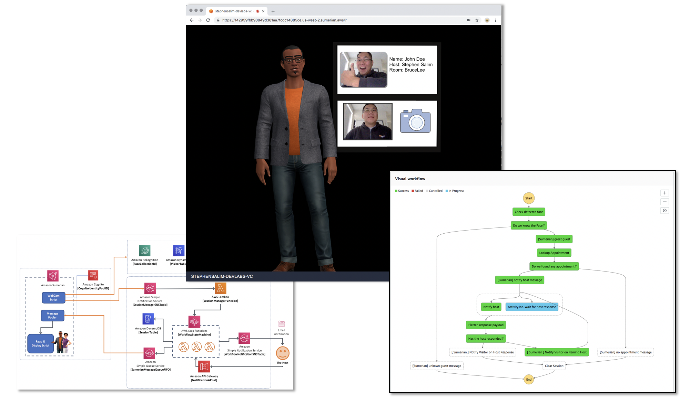 

Please follow below instructions to test our scene.

## Face unrecognised - Trigger Registration.
1. Click on the Play Icon on the Scene.

	

2. Position your face into the WebCam, then click on the camera icon to take a snap picture.

	 

3. If you would like to retake the picture click on "cross" button otherwise press the "check" button if you are ready to continue.

	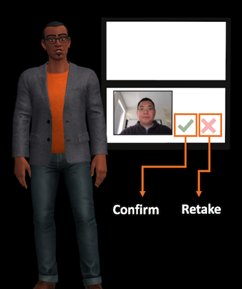 

8. At this point the **WebCamScript** will check your face against the `FaceCollectionId ` you on step 2 and it will send the result to your SNS notification to trigger the workflow `SessionManagerSNSTopic `.

9. This will in turn trigger the event in StepFunction specified in `WorkFlowStateMachine` value (deployed in step 3).

10. (Optional) If you would like to take a look on what the flow looks like in the state machine follow below steps:

	* Click Services on [AWS Console](https://us-west-2.console.aws.amazon.com/) in the Search bar type in Step Functions, select and click CloudFormation service.
	
		
	 
	* This will take you to the StepFunction Console.
	* Locate the State Machine you've created, if you follow the steps above you should see one with `WorkFlowStateMachine-` prefix. click on the State Machine name.

		
		
	* Locate for the latest execution and click on the ID.
	 
	 	
	 	
	* You should now see a section in the console with a flowchart looking graph. If you expand it, you should be able to see the steps that occured in the background and it should tell you a story on the scenario that has occured.
	
		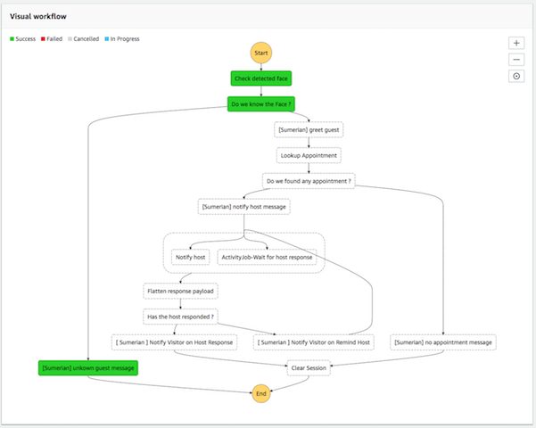
	
	* Because at the moment the `FaceCollectionId` is empty, your face are not recognised. What happened here is the workflow entered a state for unknown face and it has sent an SQS message `SumerianMessageQueueFIFO ` with instructions to show the registration page on the Sumerian scene, and for the host to say the message. 

11. So you should now see the registration page hanging on your scene.
12. Go ahead and pose for the best mug shot on the planet, click on the "camera" button, type in your name, and click submit. 

	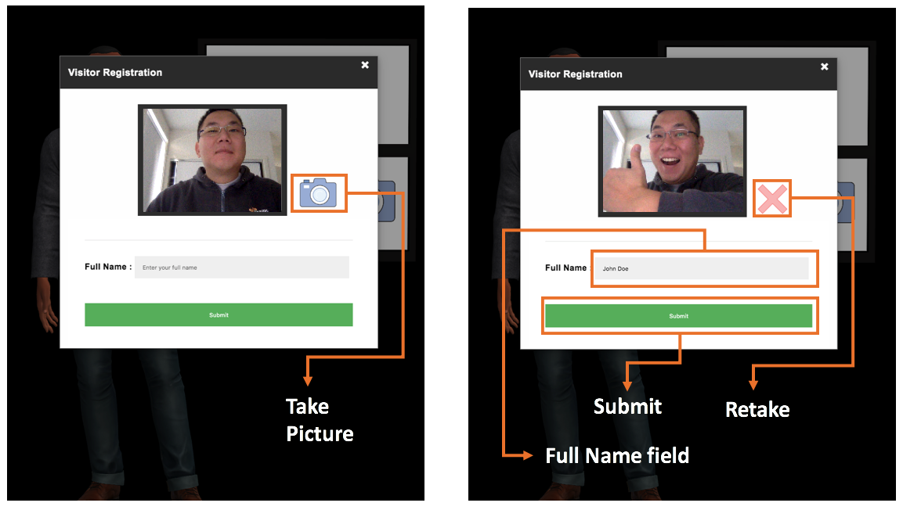

13. Once you click Submit, at this point the `RegistrationScript` in Sumerian will register your mug shot to the `FaceCollectionId`, upload your mug shot into the `FaceBucket` bucket deployed on step2. Once that's done it will then send the SNS notification `SessionManagerSNSTopic ` to trigger the workflow again.


## Face Identity Recognised - Greeting and Notification.
14. This time, your sumererian host should know your name, greet you and check for your appointment.

	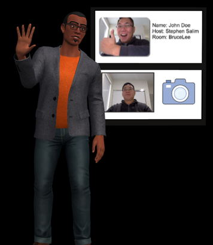

15. And if you then trace back to the State machine workflow following steps described in 5.10 you should see a workflow that looks like this.

	

16. The flow basically enters a different path of the workflow, Lookup for appointment, send different action to Sumerian and also, sent an email to the email address you've specified when building step 4. So check your email and look for an email from the SNS Topic.

**Note:**

If you are wondering how does the workflow knows if you have an appointment or not. It is basically hardcoded in function that backs Lookup Appointment state `~/workflow-lambda/appointmentlookup.py`. The purpose of this lab is to showcase how we can integrate the workflow into sumerian, and we have a very limited time to work with. You could potentially extend this function to actually call out a real appointment API ).

17. In your email you should receive a notification with 2 urls. These uri are basically prepopulated to trigger `NotificationAPIurl` api gateway which will ultimately trigger our State Machine to continue it's path. At the moment it is waiting for the host to confirm that they are coming up to pick you "the visitor".

	

## Host has not responsed - Notify guest and re-send notification.

18. Just for fun however, don't click anything yet. ignore/delete this email, and take another face capture from the scene. this is basically to emulate the behaviour that the Sumerian host has identified you once again and but the host has not respond to the email. Basically repeat step 5.2 and 5.3.

19. Your Sumerian host should say that "Your host has not responded yet and is sending him a reminder."

20. If you look at your workflow now, it should enters another different path.

	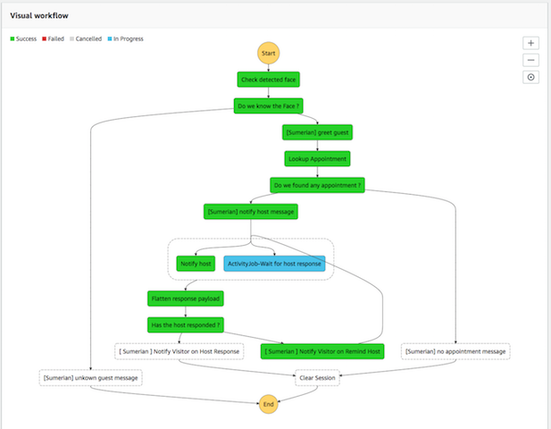

21. If you now check your email, you should be able to see a new Notification email.

## Host responsed - Notify guest and end session.
22. Finally you can go ahead and click one of the link in the email. and see how your sumerian host respond. 

	

**Note:**

If you would like to publish this scene into a real external url
Please follow [this guide](https://docs.aws.amazon.com/sumerian/latest/userguide/editor-publish.html)


--

**That's all folks !**

I hope this lab has been useful and fun. I certainly had lots of fun building it. I would love to hear your feedback on the things that you found to be good and could be improved. If you are inclined, please drop me an email and let me know your feedback.

